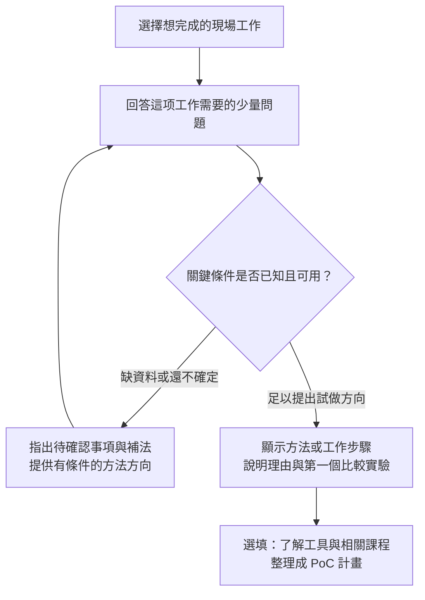

# WI-037：由現場需求推導方法的選型助手

日期：2026-09-12。本輪依使用者明確要求啟動 3 個獨立 Agent，加上主 Agent 整合。這是設計成果，沒有修改或發布新版網頁；WI-036 的操作測試不構成本設計的驗證。

## 問題與目的

使用者：「我如果可以選擇 Model，我就根本不需要使用你的功能了。」

前兩輪解決文字輸入與下拉操作，沒有承擔選型責任。現行 `_course_content/poc-workbench.js` 的 `POC_OUTPUT_ROUTES` 只有 task→output 對照；data 沒有參與方法推導。`pocFieldHTML` 將全部 TOPICS 列為候選模型，`pocFilled` 又把有效模型算入完成度。即使標示可略過，仍暗示使用者必須自己知道答案。問框、遮罩、特徵及固定契約也提前要求專業知識。

產品應回答：在我的工作與資料條件下，先試什麼方法、為什麼、缺什麼、怎樣知道值得繼續。模型名稱是結果中的工具資訊，不是主流程輸入。

## Multi Agent 結果與裁決

| 角色 | 獨立發現 | 主 Agent 採納／調整 |
|---|---|---|
| ux_flow | 長表單與模型必填暗示；建議三題起步、結果後才整理 PoC | 採納。經反證撤銷「最多加一題」的硬上限；必要前提不能為了短流程省略。 |
| selection_logic | 無資料→方法推導；需方法優先及可追溯規則 | 採納。經反證撤銷固定「一方法＋三模型」結果結構；管線步驟、替代方案與工具例子要分開。 |
| scenario_review | 六個現場案例揭露錯誤推薦與未知值陷阱 | 採納。用答案變化是否改變方法作驗收，不能只測按鈕與保存。 |

裁決：可見性檢查依任務插入，不做所有任務共同硬門檻；文字生成未必有原圖。工具例子 2–3 個只是折疊呈現策略，不是排名名額。傳統影像方法、OCR、取像改善即使沒有對應課程，也能成為合理結果，不為了課程目錄強推模型。

## 使用者會看到的流程

此圖是說明文件。實際畫面一次顯示一題，下方顯示已走過的答案路徑；不把完整方法樹攤成大型可縮放畫布。使用者選好後按「繼續」，不在點選瞬間跳頁。可點答案返回；改上游答案後重算受影響問題與結果。

### 第一次只問工作目的

「你希望電腦幫你完成什麼？」

- 檢查有沒有漏裝、數量對不對。
- 找出表面有問題的位置。
- 分辨這是哪一種產品。
- 確認位置或量實際尺寸。
- 看影片中的移動、事件或變化。
- 讀取照片上的文字或整理內容。
- 改善或產生影像作其他用途。
- 還不確定，先看具體案例。

保留使用者已要求的下拉選擇；所有問題提供「還不確定」。遇到不確定，給例子／確認方法，不轉成必填敘述欄。

### 後續問題依任務出現

| 任務 | 會改變路線的白話問題 | 分支方向 |
|---|---|---|
| 漏裝／計數 | 位置固定嗎？是否堆疊遮擋？預期每格有幾件？ | 固定位置有無核對，或找每件再計數；遮擋可能先改取像。 |
| 表面異常 | 是已知幾種缺陷，還是新的異常也要找？只需指出可疑位置，還是沿邊緣圈清楚？ | 正常參考異常篩查、受監督檢測或分割，依資料另核對。 |
| 產品種類 | 種類固定或常增加？每張只看一件嗎？ | 固定分類、多物件定位再分類，或可變候選搜尋。 |
| 每件輪廓 | 只要全部物件區域，還是每件分開？有相貼或重疊嗎？ | 整體區域分割與逐件分離不是同一交付。 |
| 位置／尺寸 | 要像素位置還是毫米？物件在同一平面嗎？有已知長度或校正資料嗎？ | 定位、校正換算與量測誤差驗證的工作鏈；缺條件先補。 |
| 影片 | 只看畫面有無改變、追每件位置，還是辨識整段動作？需要多久反應？ | 差異基準、偵測＋追蹤＋規則，或動作分析。 |
| 讀字／內容 | 要照原字抄錄、整理固定欄位，還是自由問答？文字可辨嗎？ | OCR／欄位核對基準或影像問答，核對責任不同。 |
| 生成／復原 | 用於展示、人工閱讀、補資料或檢測量測？ | 輔助影像流程；涉及判定時保留原始證據，不把補出的細節當實測。 |

資料問題隨任務調整，用「正常照片很多」「問題照片很少」「每張已整理正確答案」「已在圖上圈出每件」「還沒有照片」等普通描述。資料型態是內部推導欄位，不要求使用者認識標註格式。

檢測、讀字、量測應提早問對應線索在原圖是否看得清。模糊、反光或未知不能被當成模型能力題；先給重拍及人工核對步驟。題數依必要判斷而定，畫面顯示階段及剩餘待確認事項，不再顯示固定九欄完成率。

## 結果頁的責任

首屏要回答：

1. **現在先試什麼方法／步驟。** 可以是簡單比較基準、組合流程，或先改善取像。
2. **為什麼。** 明確引用使用者剛才的答案；指出改哪個條件會換路線。
3. **還缺什麼。** 分開「條件已足以規劃比較」「先確認某一事項」「仍有兩條可能路線」，不顯示假精確適用百分比。
4. **下一個小實驗。** 準備哪些實拍樣本、與目前什麼方式比較、核對哪些錯誤。

「可了解的工具／相關課程」置於結果後，可展開。工具有三種身份：同交付的替代候選、管線中的前後步驟、單一步驟的實作例子。不得把校正、匹配、偵測等不同角色當成排行榜。沒有適合模型或關鍵條件未知時，可以沒有模型卡；使用者仍獲得有用的下一步。

「整理成 PoC 計畫」是結果後操作：自動帶入方法、理由、資料缺口與驗證方向，再選填負責人及現場細節。主流程移除 Model 下拉與模型完成度。舊草稿保留為歷史／進階指定，不拿舊模型值主導新手推薦。

## 一個走到底的例子

回答路徑：檢查漏裝 → 墊圈放在固定格位 → 原圖能看清 → 正常照片很多、缺件照片很少。

結果：**先試「對齊固定位置，再逐格檢查有無」。**

理由：位置固定，可先比較每個裝配位置；缺件標註不足，先建立可核對的簡單基準。這只是起步方法，不保證規則必然足夠。

下一步：收正常、真實漏裝、位移／光線變化的照片；人工標出應有數量與格位，分開參考和測試，核對漏裝漏檢、正常誤報與覆核量。

改答案試試：若零件任意擺放，方向改為找每件再計數；若原圖被遮住看不清，先改善取像。使用者一路沒有選模型，但得到不同且可執行的結果。

## 六個設計驗收案例

| 案例 | 設計應產生的結果 | 必須阻止的誤判 |
|---|---|---|
| 正常品多，新缺陷少 | 正常參考異常篩查方向＋獨立測試缺口 | 不因只有正常品就保證缺陷檢出率或精準輪廓。 |
| 固定格位漏裝 | 逐格核對比較基準；改任意位置後換路 | 不把所有漏裝都推成同一偵測模型。 |
| 相貼物件逐件輪廓 | 每件分離的方案與圈選資料準備 | 不把整體前景區域當逐件輪廓。 |
| 毫米孔距，無校正 | 先準備尺寸基準／校正，保留位置取得方法 | 不把像素當毫米，不只靠分割宣布完成量測。 |
| 銘牌抄錄 | 文字區域＋辨識＋欄位核對基準 | 不以自由生成合理文字代替逐字正確。 |
| 反光模糊，人工也無法判讀 | 改善取像的比較清單 | 不因換大模型／零樣本／復原就宣稱可檢測。 |

以上是規格走查，尚未在新版程式中實作測試，也不是六位真人使用測試。

### 後續實作的驗收方式

- 隱藏所有模型名稱，初次使用者仍能走完案例並說出下一步。
- 固定位置↔任意位置、整體區域↔逐件輪廓、像素↔毫米：改一個關鍵答案，方法／前提必須相應改變。
- 不清楚取像、缺校正、資料未知：不硬給可開始模型驗收的結果。
- 返回改答案後，舊結果與下游問題重算；未知值不當成否定。
- 匯出的 Markdown 要能交給同事拍比較照片或整理真值；不是只列答案。
- 現行保存、手機、鍵盤、返回、匯出測試仍保留，但不能代替決策驗收。

## 規則資料與可維護性

獨立維護版本化決策規則，記錄 ruleId、觸發答案、必要條件、未知時追問、方法步驟、可比較候選、依賴、理由、限制、下一步與課程來源。每題需要寫出「不同答案會改變什麼」；不會改變方法、可行性或準備工作的題目移到結果後。

新增課程不自動加入推薦，先確認其交付角色、適用分支及案例。課程未涵蓋的基準也能出現在結果，清楚標示沒有對應教學頁，不把目錄範圍冒充方法全集。

## 本輪狀態

完成：三方獨立意見、兩項交叉反證、主 Agent 裁決、流程與六案例設計、Markdown 學習。未完成／未執行：新流程程式、瀏覽器決策測試、真人理解測試、新版發布。既有網站仍為 WI-036。設計使用者審閱 pending。
